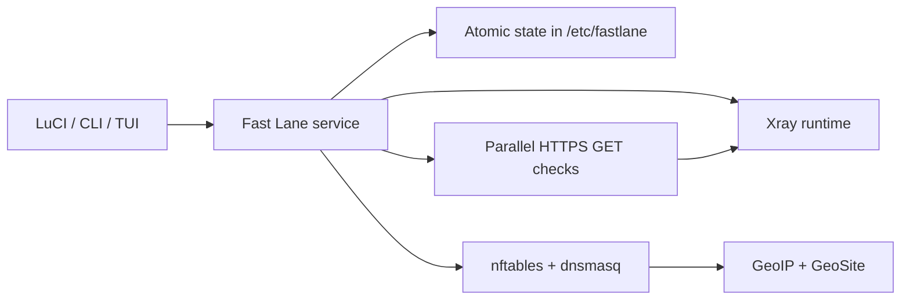

[English](README.md) · [Русский](README.ru_RU.md)

<div align="center">

# Fast Lane

**OpenWrt-native Xray management with a focused LuCI interface.**

[](https://github.com/design-maestro/fastlane/actions/workflows/ci.yml)
[](LICENSE)
[](https://openwrt.org/)
[](go.mod)

Import subscriptions and YAML files, test every server through a real HTTP GET,
and keep the router on the best working route automatically.


</div>

Captured from the real FriendlyWrt admin on **5 September 2026**, not a mockup.
Server addresses are hidden for privacy; statuses, counts, and latency are real.

<details>
<summary>More real screens: routing and settings</summary>

### Routing


### Settings


</details>

The latest source is on [`main`](https://github.com/design-maestro/fastlane/tree/main).
See [capture notes](docs/images/README.md) for screenshot provenance and verification scope.

## What it does

- Imports subscription URLs, YAML files, Xray JSON, Base64 payloads, and supported share links.
- Supports VLESS, VMess, Trojan, SOCKS5, Hysteria, and Hysteria 2 nodes.
- Runs real HTTPS GET checks through isolated candidate Xray outbounds, up to 10 at once.
- Keeps checks, progress, health state, and automatic failover in the router service—not in the browser tab.
- Selects the best healthy node across one subscription or the combined pool.
- Preserves manual mode when you intentionally pin a server.
- Excludes expired subscriptions from refresh, checks, and automatic selection while keeping them viewable.
- Routes LAN and any selected ISO country directly with GeoIP data; validated GeoSite rules are added where available.
- Uses English as the base UI, includes a complete Russian translation, and follows the LuCI language unless overridden in Settings.
- Shares one persistent state across LuCI, CLI, and TUI.
- Tests generated Xray configuration before replacing the last known working runtime.
- Checks stable GitHub releases and installs an explicitly approved update from Settings in the background. [Update channel requirements and limitations](docs/updating.md).

## How it is built



LuCI is a client of the router service. Closing the page does not cancel a queued
health check or automatic failover. See [Architecture](docs/architecture.md) and
[Configuration](docs/config.md) for the runtime contract.

## Install and remove

There is no tagged Fast Lane release yet. Use the current source and the build
instructions below; a `releases/latest` installer is not available yet.
The packaging pipeline targets `mipsel_24kc`, `x86_64`, and `aarch64_cortex-a53`.

<details>
<summary>Installation after the first release is published</summary>

First check that [Releases](https://github.com/design-maestro/fastlane/releases)
contains a compatible build and its installer. These commands are not ready for
use until those assets exist:

```sh
wget -O /tmp/fastlane-install.sh \
  "https://github.com/design-maestro/fastlane/releases/latest/download/install.sh"
sh /tmp/fastlane-install.sh
```

</details>

The installer provisions missing dependencies, installs the bundled Xray runtime
when necessary, enables the Fast Lane service, and preserves `/etc/fastlane`
during in-place updates.

Removal is available in **Settings → Remove Fast Lane**, or through the packaged
`uninstall.sh --confirm`. It removes only Fast Lane and dependencies recorded as
installed by Fast Lane, not unrelated router services.

## Build from source

Requirements: Go `1.26+`; OpenWrt/ImmortalWrt `22.03+` with `nftables` for the
router runtime.

```sh
make lint
make build
make package-release
```

Cross-build helpers:

```sh
make build-openwrt
make build-openwrt-x86_64
make build-openwrt-aarch64_cortex-a53
```

## Everyday CLI

```sh
fastlane add https://provider.example/subscription
fastlane list subscriptions
fastlane list nodes --subscription sub-1234567890
fastlane connect --auto --subscription all
fastlane status
fastlane disconnect
```

On OpenWrt, background refresh, health checks, and failover are provided by the
service:

```sh
/etc/init.d/fastlane enable
/etc/init.d/fastlane start
```

## Working on Fast Lane

Start with:

- [Product principles](PRODUCT.md)
- [Visual and interaction rules](DESIGN.md)
- [Design QA checklist](design-qa.md)
- [Contributor guide](CONTRIBUTING.md)
- [Rules for AI coding agents](AGENTS.md)
- [Security policy](SECURITY.md)

Changes go through a pull request. CI runs formatting, static checks, tests,
runtime coverage gates, and the sensitive-path guard before a change is merged.

## License

Fast Lane's original contributions are source-available under the
[PolyForm Noncommercial License 1.0.0](LICENSE). Personal and other
noncommercial use, modification, and distribution are permitted. Commercial
use requires separate written permission from Fast Lane owner Nikita Goryachev
(`design-maestro`).

Some portions are derived from an earlier MIT-licensed codebase. Its required
notice is preserved separately in [LICENSES/UPSTREAM-MIT.txt](LICENSES/UPSTREAM-MIT.txt).
See [NOTICE](NOTICE) for the exact licensing boundary. Fast Lane is not
OSI-approved open-source software because commercial use is restricted.
