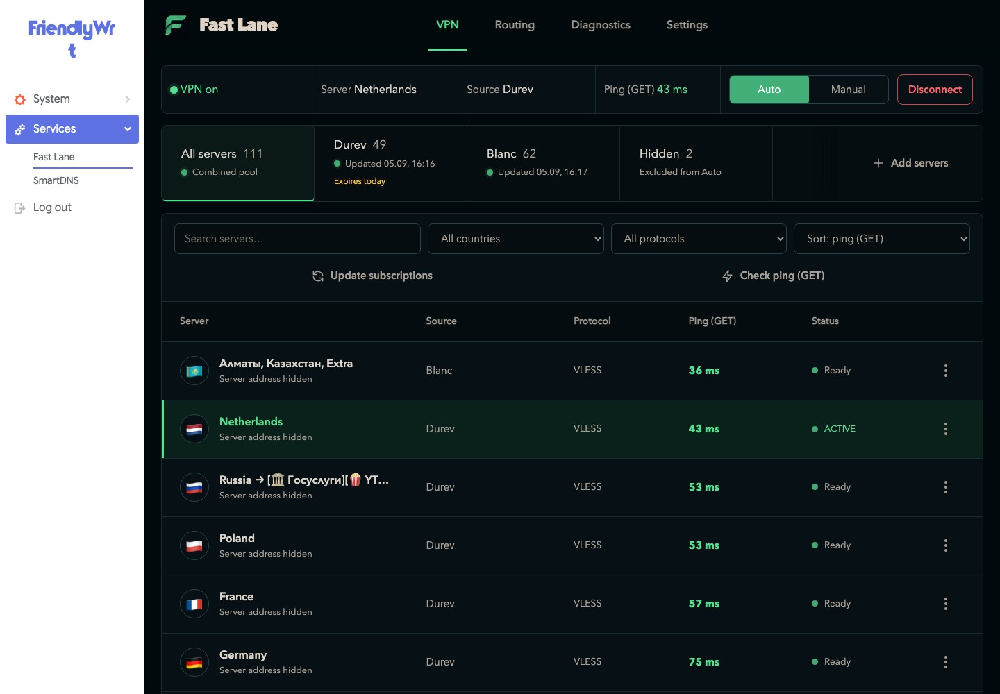
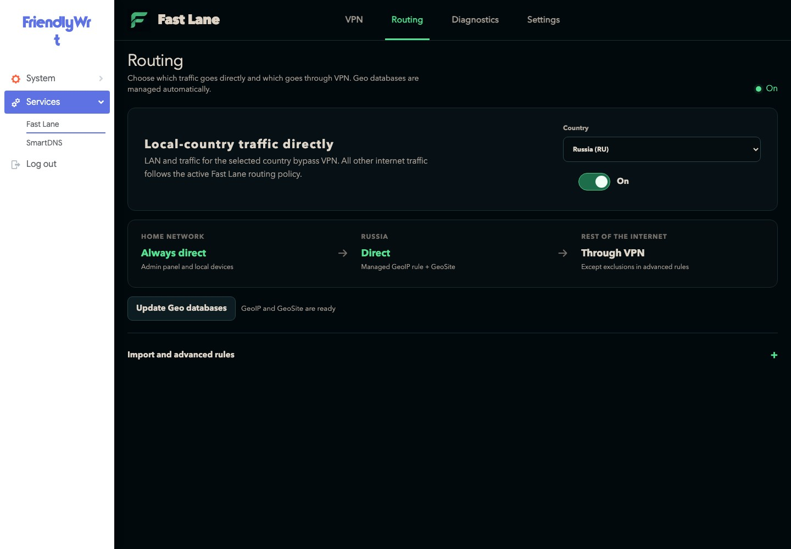
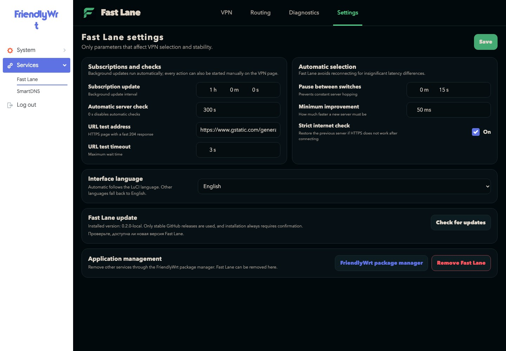
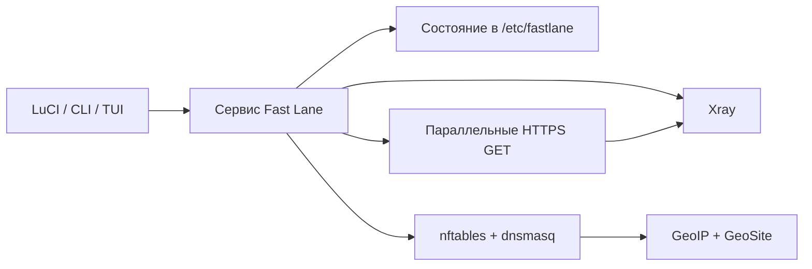

[English](README.md) · [Русский](README.ru_RU.md)

<div align="center">

# Fast Lane

**Управление Xray на OpenWrt с понятным интерфейсом LuCI.**

[](https://github.com/design-maestro/fastlane/actions/workflows/ci.yml)
[](LICENSE)
[](https://openwrt.org/)
[](go.mod)

Добавляйте подписки и YAML-файлы, проверяйте серверы реальным HTTP GET
и автоматически держите роутер на лучшем рабочем маршруте.



</div>

Снимок настоящей админки FriendlyWrt от **5 сентября 2026**, не макет.
Адреса серверов скрыты для приватности; статусы, количество серверов и пинг — реальные.

<details>
<summary>Ещё реальные экраны: маршруты и настройки</summary>

### Маршруты



### Настройки



</details>

Свежий исходный код — в ветке [`main`](https://github.com/design-maestro/fastlane/tree/main).
[Об этих снимках](docs/images/README.md): источник, приватность и границы проверки.

## Что умеет Fast Lane

- Импортирует URL подписок, YAML-файлы, Xray JSON, Base64 и поддерживаемые share-ссылки.
- Поддерживает VLESS, VMess, Trojan, SOCKS5, Hysteria и Hysteria 2.
- Проверяет серверы настоящим HTTPS GET через отдельные Xray-outbound — до 10 одновременно.
- Выполняет проверки, хранит прогресс и переключает серверы в сервисе роутера, а не во вкладке браузера.
- Выбирает лучший рабочий сервер внутри подписки или общего пула.
- Не трогает вручную закреплённый сервер, пока включён ручной режим.
- Не добавляет истёкшие подписки в обновление, GET-проверки и автовыбор, но оставляет их для просмотра.
- При включённой настройке направляет LAN и любую выбранную ISO-страну напрямую по GeoIP; для проверенных стран добавляет GeoSite-правила.
- Использует английский как базовый язык, содержит полный русский перевод и по умолчанию наследует язык LuCI; язык можно изменить в настройках.
- Показывает единое состояние в LuCI, CLI и TUI.
- Проверяет новый конфиг через `xray -test` до замены последней рабочей конфигурации.
- Проверяет стабильные релизы GitHub и устанавливает подтверждённое обновление в фоне из настроек. [Требования к каналу и ограничения](docs/updating.md).

## Как это устроено



LuCI только отправляет команды сервису и читает его состояние. Закрытие страницы
не отменяет запущенную проверку или фоновое автопереключение. Подробности:
[архитектура](docs/architecture.md) и [настройки](docs/config.md).

## Установка и удаление

Релиза Fast Lane с тегом пока нет. Используйте актуальный исходный код и инструкции
сборки ниже: готового установщика по ссылке `releases/latest` ещё нет.
Сборка пакетов рассчитана на `mipsel_24kc`, `x86_64` и `aarch64_cortex-a53`.

<details>
<summary>Установка после публикации первого релиза</summary>

Сначала убедитесь, что в [Releases](https://github.com/design-maestro/fastlane/releases)
появились совместимая сборка и установщик. До появления этих файлов команды
ниже использовать нельзя:

```sh
wget -O /tmp/fastlane-install.sh \
  "https://github.com/design-maestro/fastlane/releases/latest/download/install.sh"
sh /tmp/fastlane-install.sh
```

</details>

Установщик добавляет недостающие зависимости, при необходимости ставит Xray,
включает сервис Fast Lane и сохраняет `/etc/fastlane` при обновлениях.

Удаление доступно в **Настройки → Удалить Fast Lane** или через поставляемый
`uninstall.sh --confirm`. Удаляются только Fast Lane и зависимости, установленные
самим Fast Lane по манифесту. Посторонние службы роутера не удаляются вслепую.

## Сборка

Нужны Go `1.26+` и OpenWrt/ImmortalWrt `22.03+` с `nftables` для запуска на
роутере.

```sh
make lint
make build
make package-release
```

## Повседневные команды

```sh
fastlane add https://provider.example/subscription
fastlane list subscriptions
fastlane list nodes --subscription sub-1234567890
fastlane connect --auto --subscription all
fastlane status
fastlane disconnect
```

Фоновая работа на OpenWrt:

```sh
/etc/init.d/fastlane enable
/etc/init.d/fastlane start
```

## Как вносить изменения

Перед работой прочитайте:

- [продуктовые принципы](PRODUCT.md);
- [визуальные и поведенческие правила](DESIGN.md);
- [чек-лист проверки интерфейса](design-qa.md);
- [правила участия](CONTRIBUTING.md);
- [правила для ИИ-агентов](AGENTS.md);
- [политику безопасности](SECURITY.md).

Все изменения проходят через pull request. CI проверяет форматирование, код,
тесты, покрытие критического runtime и отсутствие чувствительных файлов.

## Лицензия

[MIT](LICENSE)
